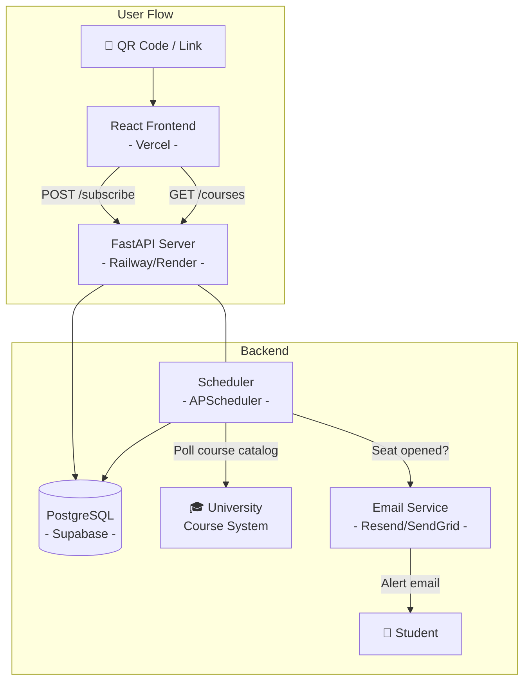

# 📢 Course Notifier

---

## 1. Project Overview

**Course Notifier** is a free tool that alerts university students the moment a seat opens in a full course section. The workflow is simple: a student scans a QR code (posted around campus or shared online), lands on a lightweight web page, enters their course code, and subscribes for email notifications. When the system detects availability, the student gets an instant alert so they can register before the seat fills again. For paying users, we can have the seat automatically picked for them and notified them in the email.

**The problem it solves:** Students currently resort to obsessively refreshing their university's course catalog, hoping to catch an opening. Course Notifier automates that watch and delivers a notification the moment a spot becomes available — saving hours of manual checking and reducing the chance of missing an opening entirely.

---

## 2. Platform Recommendation

### Recommendation: **Web App (QR Code → Website)**| Option | Pros | Cons |

|---|---|---|
| **Web App** ✅ | Universal access (any device with a browser); seamless QR code flow; no account creation required; easy to share links | Notification delivery requires email or push setup 

---

## 3. Feature Scope

### MVP (Month 1)

- **Landing page** — clean, mobile-first page explaining the tool with a single CTA
- **Course search / selection** — student enters a course code (e.g., `COMP 248`), system validates it exists
- **Email subscription** — student provides email, subscribes to notifications for that course
- **Course availability polling** — backend periodically checks the university's course catalog for seat availability
- **Email notification** — sends an alert email when a seat opens in a watched course
- **Unsubscribe** — one-click unsubscribe link in every email
- **QR code** — static QR code pointing to the production URL, ready for print/distribution
- **Basic admin visibility** — simple logging/dashboard for the team to monitor active subscriptions and polling health

### Nice-to-Haves (Month 2 & Beyond)

- Multi-course watch list per student
- Course popularity/demand analytics dashboard
- Rate limiting and abuse protection hardening
- Discord bot as a secondary channel

---

## 4. Architecture Overview

### Flow Summary

1. Student scans QR code → opens React landing page.
2. Student searches for their course code, enters their email, and subscribes.
3. Frontend calls FastAPI backend to validate the course and store the subscription in PostgreSQL.
4. A background scheduler (APScheduler) periodically polls the university's course availability source (API or web scrape).
5. When a previously-full course has an open seat, the scheduler triggers an email via Resend/SendGrid to all subscribers watching that course.
6. Student receives email, clicks link to register for the course on the university's site.

---

## 6. Task Delegation

### Backend Team

| Member | Primary Ownership | Secondary |
|---|---|---|
| **Parsa** | Architecture decisions, code review, API design, overall oversight | Backend debugging, integration testing |
| **Mubeen** | Course polling engine (scheduler + scraper/API client), data models | Can flex to frontend if needed during Month 2 |
| **flameboyX360** | API endpoints (FastAPI), deployment pipeline (CI/CD, hosting setup), infrastructure | Database setup, monitoring/logging |

### Frontend Team

| Member | Primary Ownership | Secondary |
|---|---|---|
| **Annie** | UI/UX design (Figma/mockups), component design system, landing page | Frontend integration with API |
| **Jason** | Course search page, subscription flow, email input/validation, unsubscribe page | Responsive testing, accessibility |

### Shared Responsibilities

- **Design:** Annie leads; Jason contributes feedback and implements.
- **Deployment:** flameboyX360 leads; Parsa and Mubeen assist with backend deployment and environment setup.
- **Code Review:** Parsa reviews all PRs. Frontend devs review each other's PRs. Backend devs review each other's PRs.
- **Testing:** Everyone writes tests for their own components. Integration testing is a backend team responsibility.

---

## 7. Phases & Timeline

### Phase 1 — Foundation (Weeks 1–2) `MVP Sprint 1`

| Task | Owner | Deadline |
|---|---|---|
| Finalize tech stack, repo setup, CI/CD scaffold | Parsa + flameboyX360 | Day 2 |
| Design mockups (landing, search, subscribe flow) | Annie | End of Week 1 |
| Database schema + models (subscriptions, courses) | Mubeen | End of Week 1 |
| FastAPI project scaffold + core endpoints (`/courses`, `/subscribe`) | flameboyX360 | End of Week 2 |
| React project scaffold + routing + landing page | Jason | End of Week 2 |
| Research university course data source (API or scrape target) | Parsa + Mubeen | End of Week 1 |

**Milestone:** Backend serves course data, frontend renders landing page, DB is provisioned.

### Phase 2 — Core Features `MVP Sprint 2`

| Task | Owner | Deadline |
|---|---|---|
| Course polling scheduler (APScheduler + scraper) | Mubeen | End of Week 3 |
| Email notification pipeline (Resend/SendGrid integration) | flameboyX360 | End of Week 3 |
| Course search UI + subscribe form | Jason | End of Week 3 |
| Frontend ↔ Backend integration | Annie + Jason + flameboyX360 | End of Week 4 |
| Unsubscribe flow (backend + frontend) | Mubeen + Jason | End of Week 4 |
| QR code generation + print-ready asset | Annie | End of Week 4 |
| End-to-end testing + bug fixes | All | End of Week 4 |

**Milestone: MVP shipped.** A student can scan, subscribe, and receive a notification email.

### Phase 3 — Polish & Harden `Post-MVP`

| Task | Owner | Deadline |
|---|---|---|
| UI polish, animations, mobile responsiveness audit | Annie + Jason | Week 6 |
| Rate limiting, input validation hardening, abuse protection | Parsa + Mubeen | Week 6 |
| Monitoring dashboard (subscription counts, polling health) | flameboyX360 | Week 7 |
| Multi-course watch list | Mubeen + Jason | Week 7 |
| Load testing + performance optimization | Parsa + flameboyX360 | Week 8 |
| Documentation + onboarding guide | All | Week 8 |

**Milestone: Polished product ready for wider campus rollout.**

---
## Definition of Done — MVP

The MVP is **shipped** when all of the following are true:

- [ ] A student can scan a QR code and land on the Course Notifier web page on any modern mobile or desktop browser.
- [ ] The student can search for a course by code and see whether it is being tracked.
- [ ] The student can enter their email and subscribe to notifications for a specific course.
- [ ] The backend polls the university course catalog on a scheduled interval (configurable, default every 5–10 minutes).
- [ ] When a seat opens in a watched course, all subscribed students receive an email notification within one polling cycle.
- [ ] Every notification email contains a working one-click unsubscribe link.
- [ ] The system handles at least 200 concurrent subscriptions without degradation.
- [ ] The application is deployed and accessible via a public URL at zero cost.
- [ ] A QR code asset is generated and ready for campus distribution.
- [ ] Basic logging exists so the team can diagnose issues in production.
- [ ] The README (this document) is up to date and the repo has a clear folder structure.

---
